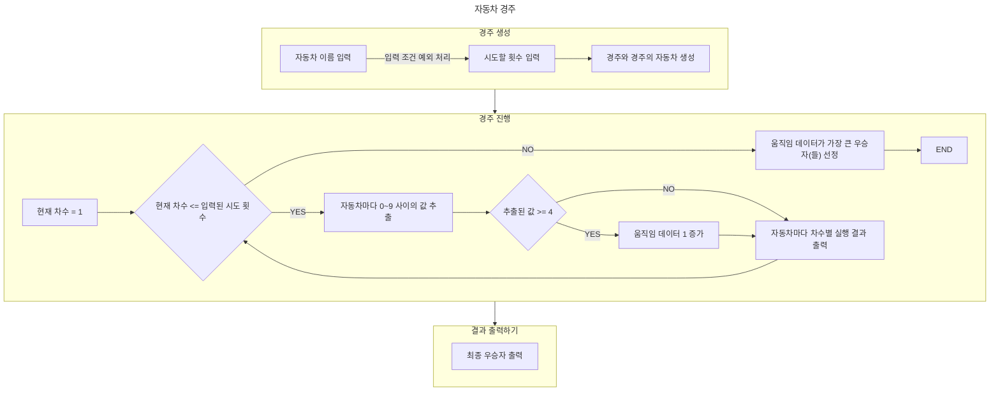

# kotlin-racingcar-precourse
## 2주차 - 자동차 경주
초간단 자동차 경주 게임을 구현한다.

## 📝 기능 목록

### 경주 생성
- 자동차 이름 입력 받기 
  예외 처리
  - 쉼표가 아닌 문자 중 알파벳이 아닌 문자가 존재하는 경우 예외 발생
  - 자동차 이름이 5자를 초과하는 경우 예외 발생
  - 자동차 이름이 비어 있는 경우 예외 발생
  - 시도 횟수가 비어 있는 경우 0으로 처리. 예외 발생시키지 않음
- 시도할 횟수 입력 받기
- 경주에 참여하는 자동차와 경주 생성

### 경주 진행
- 현재 차수가 입력 받은 시도 횟수보다 작은지 확인
    - 시도 횟수를 초과하는 경우 우승자 선정
- 자동차마다 0~9 사이의 무작위 값 추출
    - 추출된 값이 4 이상인 경우 움직임 데이터 1 증가
- 자동차마다 해당 차수의 실행 결과 출력

### 경주 결과 출력
- 최종 우승자 출력

## 🔃플로우 차트
