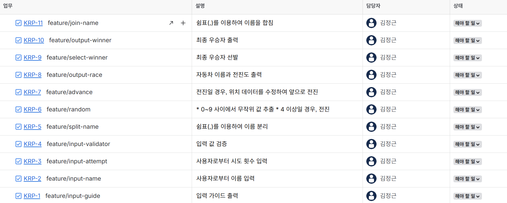

# kotlin-racingcar-precourse

## 기능 목록

기능 목록은 아래와 같은 형식을 따름
> - [x] **{기능명}** **:** **({branch-type}/{ticket-number}-{description})**

- [ ] **입력 가이드 출력 : (feature/KRP-1-input-guide)**
    - [ ] _"경주할 자동차 이름을 입력하세요.(이름은 쉼표(,) 기준으로 구분)"_ 가이드 문구 출력
    - [ ] _"시도할 횟수는 몇 회인가요?"_ 가이드 문구 출력
- [ ] **자동차 이름 입력 : (feature/KRP-2-input-name)**
- [ ] **시도 횟수 입력 : (feature/WWC-KRP-3-input-attempt)**
- [ ] **이름 분리 : (feature/KRP-5-split-name)**
    - [ ] 쉼표(,)를 이용하여 이름 분리
- [ ] **입력 값 검증 : (feature/KRP-4-validator)**
- [ ] **무작위 값 추출 : (feature/KRP-6-random)**
    - [ ] 0~9 사이의 무작위 값 추출
    - [ ] 4 이상일 경우, 전진(`true`)
- [ ] **자동차 전진 : (feature/KRP-7-advance)**
    - [ ] 전진일 경우, 위치 데이터를 수정하여 앞으로 전진
- [ ] **최종 우승자 선발 : (feature/KRP-9-select-winner)**
- [ ] **최종 우승자 이름 합치기 : (feature/KRP-11-join-name)**
    - [ ] 쉼표(,)를 이용하여 이름을 합칩
- [ ] **자동차 이름 및 전진도 출력 : (feature/KRP-8-output-race)**
- [ ] **최종 우승자 출력 : (feature/KRP-10-output-winner)**



## 입력 상황 정리

| Index | 요약           | 입력               | 예상 출력(대표)                                 | 사유                                                                                                                                                                               |
|-------|--------------|------------------|-------------------------------------------|----------------------------------------------------------------------------------------------------------------------------------------------------------------------------------|
| 1     | 빈 문자         |                  | `ILLEGALARGUMENTEXCEPTION`                | 빈 문자는 이름으로 사용할 수 없다.                                                                                                                                                             |
| 2     | 연속 쉼표(`,`)   | `pobi,,,`        | `ILLEGALARGUMENTEXCEPTION`                | `{"POBI", "", "", ""}`와 같은 상태이다. 1번 예시와 마찬가지로 빈 문자는 이름으로 사용할 수 없다.                                                                                                               |
| 3     | 5자 초과        | `pobi:woni`      | `ILLEGALARGUMENTEXCEPTION`                | `{"pobi:woni"}`와 같은 상태이다. `:`는 구분의 대상이 아니기에 하나의 문자열로 처리 되고, 총 9자로 길이 초과이다.                                                                                                       |
| 4     | 5자 초과        | `poooooobi`      | `IllegalArgumentException`                | 3번 예시와 마찬가지로 길이 초과이다.                                                                                                                                                            |
| 5     | space(` `)사용 | `pobi,wo ni`     | `최종 우승자 : pobi`,<br/>`최종 우승자 : wo ni`     | 정상 입력이다. `"wo ni"`는 space(` `)가 포함되긴 하였지만, 5자 이하이므로 가능하다.                                                                                                                        |
| 6     | 중복 이름        | `pobi,pobi,pobi` | `최종 우승자 : pobi`,<br/>`최종 우승자 : pobi,pobi` | 정상 입력이다. 이름 중복은 흔한 상황이다. `{"pobi", "pobi", "pobi"}`와 같이 3개의 객체가 만들어져야 한다. 이름을 `key`로, 길이를 `value`(`map`)로 처리로 처리할 경우, 같은 `key`값인 `"pobi"`에서 시존 값을 덮어 써버리는 문제가 발생할 수 있기에 주의해야 한다. |
| 7     | 이름으로 숫자를 입력  | `jun32`          | `최종 우승자 : jun32`                          | 정상 입력이다. 자동차 이름에는 숫자가 들어갈 수 있다.                                                                                                                                                  |
| 8     | 음수 시도 횟수     | `-1`             | `IllegalArgumentException`                | 시도 횟수는 양의 정수만 받을 수 있다.                                                                                                                                                           |
| 9     | 0회 시도 횟수     | `0`              | `IllegalArgumentException`                | 시도 횟수는 양의 정수만 받을 수 있다.                                                                                                                                                           |
| 10    | 소수점 시도 횟수    | `3.14`           | `IllegalArgumentException`                | 시도 횟수는 양의 정수만 받을 수 있다.                                                                                                                                                           |
| 11    | 숫자가 아닌 시도 횟수 | `일`              | `IllegalArgumentException`                | 시도 횟수는 양의 정수만 받을 수 있다.                                                                                                                                                           |
| 12    | 3회 시도        | `3`              | `최종 우승자 : pobi`                           | 정상 입력이다.                                                                                                                                                                         |

## 파일 구조

```dir
.
├── README.md
├── res
│   └── Jira.png
├── settings.gradle
└── src
    ├── main
    │   └── kotlin
    │       └── calculator
    │           └── Application.kt
    └── test 
       └── kotlin 
            └── calculator 
                └── ApplicationTest.kt 
                    
10 directories, 11 files
```